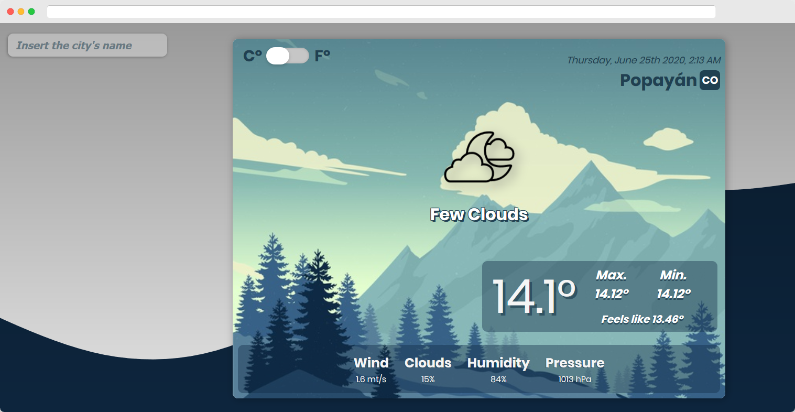

# Js-weather
Javascript  Weather web app



## # JS-Weather-app [Live Link]()

## Usage

> Clone the repository to your local machine using ssh:

```bash
git clone git@github.com:leonmezu1/Js-weather.git
```

> Clone the repository to your local machine using https:

```bash
git clone https://github.com/leonmezu1/Js-weather.git
```

> cd into the directory

```bash
cd JS-Weather-app
```

> Run Server Locally

```bash
npm run start
```

## Features

- Vanilla Javascript
- OpenWeather API
- SweetAlert2
- Webpack

## Developed by
- Leonardo Mezu [Github](https://github.com/leonmezu1)